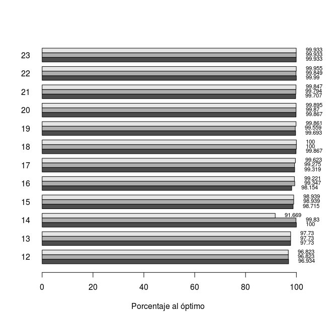
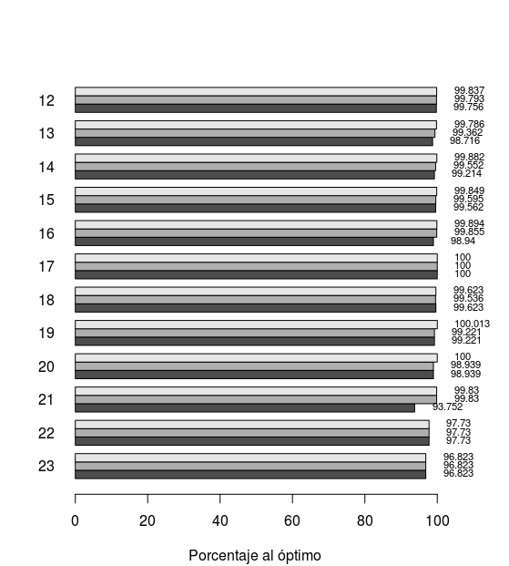

```{r setup, include=FALSE}
knitr::opts_chunk$set(echo = TRUE)
```

## GRASP

Para el GRASP se partió de un algoritmo greedy que ordena los elementos de la mochila por tasa de ganancia
(ganancia/peso) y toma los elementos de mayor a menor tasa que entren en la misma. 
La lista de candidatos reducida se obtiene a particionando la lista de datos original (ordenada por tasa) reteniendo todos los elementos desde el primero hasta  el indice del último elemento seleccionado por el greedy sumado a un factor por ese mismo número.
Esta forma de calcular cuáles elementos componen el LRC se comparó experimentalmente con otras estrategias, como el uso de la media y el promedio (multiplicados por factores), resultando más eficiente que los otros.

### Búsqueda local 1

Por cada uno de los primeros N elementos del LRC (configurable mediante el parámetro `neighbourhood_size`),
se selecciona ese elemento y se toman los demás seleccionándolos según una distribución de probabilidad que beneficia a los elementos de menor tasa. La distribución se recalcula antes de seleccionar un elemento.


|max_iterations|lrc_factor|neighbourhood_size
|--|--|--|
|10|0.01|20
|10|0.02|15
|10|0.6|15

 
Donde la cantidad de iteraciones se dejó en 10 porque para números superiores no se apreciaban mejoras significativas y en cambio incrementaban sustancialmente el tiempo de ejecución.




### Búsqueda local 2

Para cada uno de los primeros N elementos de LRC no seleccionados en la solución greedy aleatoria, se selecciona el elemento y se vuelve a aplicar greedy sobre el resto.
Esta estrategia es más rápida que la anterior, ya que no requiere recalcular probabilidades, con lo cual puede aumentarse la cantidad de iteraciones para mejorar los resultados.

|max_iterations|lrc_factor|neighbourhood_size
|--|--|--|
|25|0.01|5
|10|0.02|5
|5|0.03|2

 
 
### Conclusión

Ambos obtienen resultados cercanos al óptimo, siendo el método 1 más preciso en la mayoría de los casos, pero siendo el método 2 más rápido.
 
## Branch & Bound

### Criterio de branching

Se elije de a un elemento si se coloca en la mochila o no.

## División del subproblema

Se analizan primero las ramas para las cuales no se selecciona el elemento en cuestión. Y se comienza por los elementos con menor tasa, para descartarlos de manera temprana.

Se tomó esta decisión porque el caso contrario (comenzar seleccionando por los elementos de mayor tasa) generaba tiempos más altos, ej:

|Test|Resultado Greedy|Iteraciones|Optimo|Obtenido|Tiempo|
|--|--|--|--|--|--|
|tests/test_012_2e1.in|1472|415|1794|1794|0.154999999999745|
|tests/test_013_2e1.in|1880|452|2291|2291|0.171000000000276|
|tests/test_014_2e1.in|3475|1629|4129|4129|0.522999999999229|

Mientras que yendo primero por los elementos de menor tasa se llega a:


|Test|Resultado Greedy|Iteraciones|Optimo|Obtenido|Tiempo|
|--|--|--|--|--|--|
|tests/test_012_2e1.in|1472|148|1794|1794|0.081000000000131|
|tests/test_013_2e1.in|1880|110|2291|2291|0.0549999999993815|
|tests/test_014_2e1.in|3475|221|4129|4129|0.128000000000611|


## Heurística Primal

En cada nodo se calcula su cota inferior mediante el algoritmo greedy que toma primero los elementos de mayor tasa, y una cota superior mediante la relajación de la mochila fraccionaria. Ambas se aplican sobre los nodos no elegidos, es decir, se toman en cuenta las decisiones tomadas en cada nodo. Si resulta que la cota superior del nodo actual es menor a la mayor cota inferior que se haya encontrado hasta el momento, se descartan todos los hijos de dicho nodo ya que es imposible que generen resultados mejores. También se descartan sus hijos si se acabó el espacio de la mochila.


|Test|Greedy|Iteraciones|Optimo|Obtenido|Tiempo|Cortó|
|--|--|--|--|--|--|--|
|tests/test_012_2e1.in|1472|148|1794|1794|0.081000000|no|
|tests/test_013_2e1.in|1880|110|2291|2291|0.0549999999|no|
|tests/test_014_2e1.in|3475|221|4129|4129|0.128000000|no|
|tests/test_015_2e2.in|5193|719|5370|5370|2.24200000|no|
|tests/test_016_2e2.in|7735|15273|7962|7962|27.7250000|no|
|tests/test_017_2e2.in|6651|6479|6898|6898|11.6619999|no|
|tests/test_018_1e3.in|7468|60988|7500|7468|57.0219999|sí|

## Comparaciones: GRASP, Branch&Bound y Backtracking

Para simplificar la tabla se toma como referencia al test 17 y se promedian resultados.

|Algoritmo| Cercanía al óptimo| Tiempo|
|--| -- | -- |
|GRASP| 99% | 0.332s |
|Branch&Bound| 100% | 11.661s|
|Backtracking| 100% | 156.784s (cortando por tiempo)|

Se observa que GRASP provee resultados de gran calidad en poco tiempo, llegando a obtener el óptimo en varias instancias.
Para instancias no muy grandes, branch&bound ejecuta en un tiempo aceptable, pero se vuelve muy lento para instancias grandes y termina cortando por cantidad de iteraciones. 
