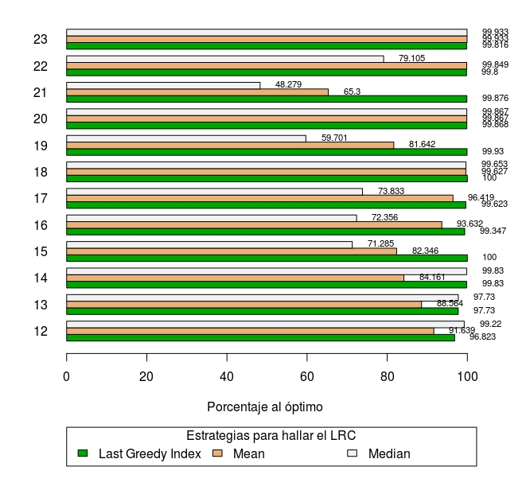
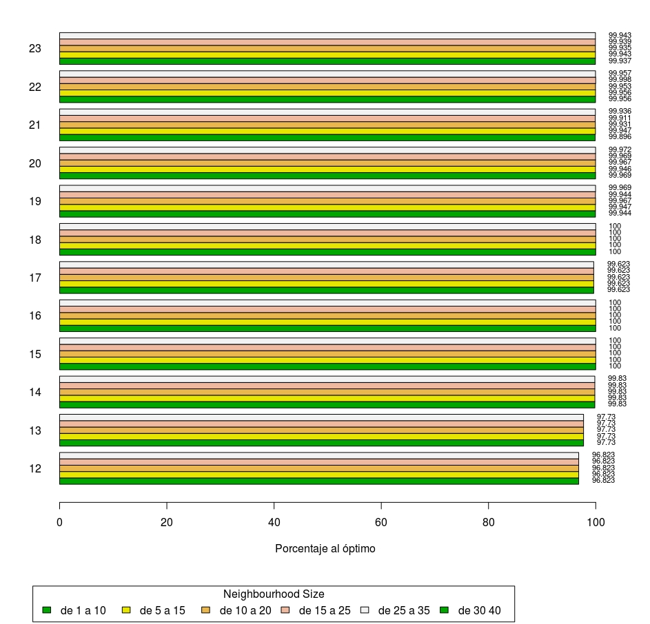
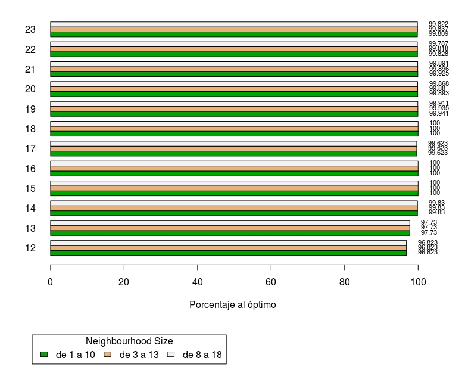
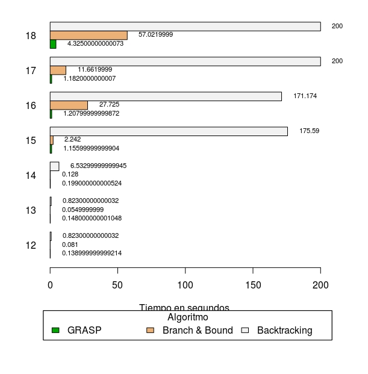

TP Algoritmos: Mochila Binaria
================

GRASP
-----

### Greedy 

Para el GRASP se partió de un algoritmo greedy que ordena los elementos de la mochila por tasa de ganancia (ganancia/peso) y toma los elementos de mayor a menor tasa que entren en la misma. 

### LRC

Se experimentaron con tres estrategias diferentes para generar una lista reducida de candidatos:

#### Media de tasas con ajuste

Se calcula la media de las tasas y se la aumenta según un factor `lrc_condition <- mean - mean*factor`,
luego se construye la LRC con todos los elementos cuya tasa sea mayor o igual a `lrc_condition`.

#### Mediana de tasas con ajuste

Se calcula la mediana de las tasas y se la aumenta según un factor `lrc_condition <- mediana - mediana*factor`, luego se construye la LRC con todos los elementos cuya tasa sea mayor o igual a `lrc_condition`.

#### Último elemento tomado por algoritmo greedy con ajuste

Se toma el índice del último elemento elegido por el greedy y se construye la LRC tomando elementos hasta el índice `index + index*factor`.


#### Comparación:

En el siguiente gráfico se comparan las tres estrategias para todos los casos de testeo:



Donde se concluye que la tercer estrategia (last greedy index) obtiene mejores resultados en la gran mayoría de los casos. 


### Búsqueda local 1

Se usa una distribución de probabilidad para seleccionar al siguiente elemento, y se exploran tantas soluciones como indique `neighbourhood_size`
(aclaración: las listas comienzan en la posición 1, no 0).

```
function busqueda_local(solucion, mejor_ganancia, lrc, capacidad_original, neighbourhood_size){
  restantes <- lrc
  Por cada x en 1..min(largo(lrc),neighbourhood_size) {
    ganancia <- 0
    max_index <- x
    capacidad <- capacidad_original
    elemento  <- restantes[max_index]
    restantes <- restantes sin el elemento de la posición max_index
    if(capacidad - elemento.peso > 0){
      capacidad <- capacidad - elemento.peso
      ganancia  <- ganancia + elemento.ganancia   
    }
    
    Por cada i en 1..largo(lrc) {
      if(remaining está vacío) break
      
      tasa_total <- sumatoria(tasas en remaining)
      distribucion <- por cada elem en remaining: elem.tasa/tasa_total
      max_index <- se selecciona una posicion de remaining según las probabilidades dadas por distribucion
      elemento <- remaining[max_index]
      restantes <- restantes sin el elemento de la posición max_index
      if(capacidad - elemento.peso > 0){
        capacidad <- capacidad - elemento.peso
        ganancia  <- ganancia + elemento.ganancia   
      }
      
      mejor_ganancia <- max(mejor_ganancia, ganancia[1,])
    }
    
    return mejor_ganancia
    
  }
  
```

Se corrieron los tests para diferentes valores de `neighbourhood_size`



Se observa que mayores valores de `neighbourhood_size` no necesariamente mejoran los resultados finales. Esto puede deberse a que en algunos casos el elemento necesario para llegar a la solución óptima no forma parte del LRC.

### Búsqueda local 2

Para cada uno de los primeros N elementos de LRC no seleccionados en la solución greedy aleatoria, se selecciona el elemento y se vuelve a aplicar greedy sobre el resto. 

```
function local_search(solucion, mejor_ganancia, lrc, capacidad_original, neighbourhood_size){

  sel_aux <- lista de tamaño lrc inicializada con valores FALSE
  u <- 1
  for(i in 1:neighbourhood_size){
    u <- siguiente posición de un elemento seleccionado en solución a partir de la posición u
    
    ganancia_total <- lrc[u].ganancia
    capacidad <- capacidad_original - lrc[u].capacidad
    Por cada i en 1..largo(lrc) {
      if(lrc[i] entra en la capacidad  && i no es la posición fijada por u){
        sel_aux[i] <- TRUE
        capacidad <- capacidad - lrc[i].capacidad
        gananciaTotal <- gananciaTotal + lrc[i].ganancia    
      }
    }
    
    if(ganancia_total > mejor_ganancia){
      mejor_ganancia <- ganancia_total
      seleccionados <- sel_aux
    }
    
    u <- u + 1
    if(u > largo(seleccionados)){
      break
    }
  }
  
  return(mejor_ganancia)
}
```




### Conclusión

Ambos obtienen resultados cercanos al óptimo, siendo el método 1 más preciso en la mayoría de los casos, para igual cantidad de iteraciones de GRASP (30).

Branch & Bound
--------------

### Criterio de branching

Se elije de a un elemento si se coloca en la mochila o no.

División del subproblema
------------------------

Se analizan primero las ramas para las cuales no se selecciona el elemento en cuestión. Y se comienza por los elementos con menor tasa, para descartarlos de manera temprana.

Se tomó esta decisión porque el caso contrario (comenzar seleccionando por los elementos de mayor tasa) generaba tiempos más altos, ej:

|Test|Resultado Greedy|Cant. Nodos|Optimo|Obtenido|Tiempo|
|--|--|--|--|--|--|
|tests/test_012_2e1.in|1472|894|1794|1794|0.336999999999534|
|tests/test_013_2e1.in|1880|314|2291|2291|0.153999999998632|
|tests/test_014_2e1.in|3475|120|4129|4129|0.0630000000019209|
|tests/test_015_2e2.in|5193|6454|5370|5370|38.2999999999993|
|tests/test_016_2e2.in|7735|50015|7962|7759|274.209999999999|
|tests/test_017_2e2.in|6651|50008|6898|6698|165.702000000001|
|tests/test_018_1e3.in|7468|50746|7500|7500|64.1810000000005|

Mientras que yendo primero por los elementos de menor tasa se llega a:

|Test|Resultado Greedy| Cant. Nodos |Optimo|Obtenido|Tiempo|
|--|--|--|--|--|--|
|tests/test_012_2e1.in|1472|148|1794|1794|0.0840000000025611|
|tests/test_013_2e1.in|1880|110|2291|2291|0.0569999999970605|
|tests/test_014_2e1.in|3475|221|4129|4129|0.127000000000407|
|tests/test_015_2e2.in|5193|719|5370|5370|2.14199999999983|
|tests/test_016_2e2.in|7735|15273|7962|7962|29.2530000000006|
|tests/test_017_2e2.in|6651|6479|6898|6898|11.9530000000013|
|tests/test_018_1e3.in|7468|50988|7500|7468|55.969000000001|

Las primeras 7 instancias alcanzan para observar la diferencia considerable de tiempo entre uno y otro.


Heurística Primal
-----------------

En cada nodo se calcula su cota inferior mediante el algoritmo greedy que toma primero los elementos de mayor tasa, y una cota superior mediante la relajación de la mochila fraccionaria. Ambas se aplican sobre los nodos no elegidos, es decir, se toman en cuenta las decisiones tomadas en cada nodo. Si resulta que la cota superior del nodo actual es menor a la mayor cota inferior que se haya encontrado hasta el momento, se descartan todos los hijos de dicho nodo ya que es imposible que generen resultados mejores. También se descartan sus hijos si se acabó el espacio de la mochila.

| Test                    | Greedy | Cant. Nodos | Optimo | Obtenido | Tiempo       | Cortó |
|-------------------------|--------|-------------|--------|----------|--------------|-------|
| tests/test\_012\_2e1.in | 1472   | 148         | 1794   | 1794     | 0.081000000  | no    |
| tests/test\_013\_2e1.in | 1880   | 110         | 2291   | 2291     | 0.0549999999 | no    |
| tests/test\_014\_2e1.in | 3475   | 221         | 4129   | 4129     | 0.128000000  | no    |
| tests/test\_015\_2e2.in | 5193   | 719         | 5370   | 5370     | 2.24200000   | no    |
| tests/test\_016\_2e2.in | 7735   | 15273       | 7962   | 7962     | 27.7250000   | no    |
| tests/test\_017\_2e2.in | 6651   | 6479        | 6898   | 6898     | 11.6619999   | no    |
| tests/test\_018\_1e3.in | 7468   | 60988       | 7500   | 7468     | 57.0219999   | sí    |


Comparaciones: GRASP, Branch&Bound y Backtracking
-------------------------------------------------

Comparación en tiempo de ejecución de cada algoritmo:


